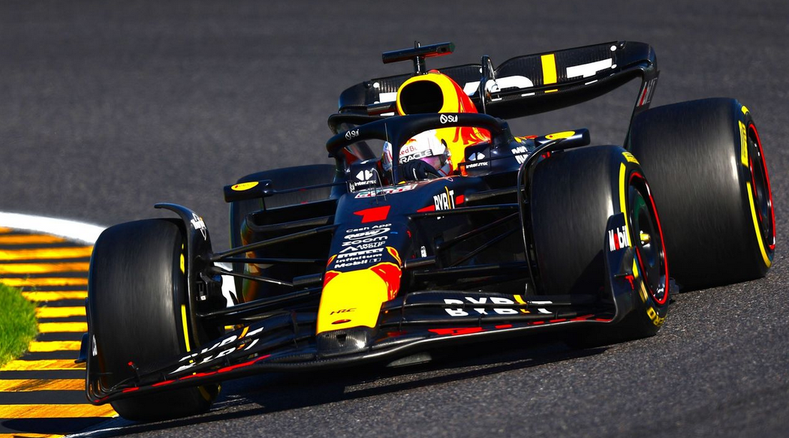

<div id="top">

<div align="center">

# F1-ML-PROJECT

<em>Unlocking insights for winning Formula 1 strategies.</em>


</div>
<br>

<div align="center">
  
  </div>
<br>
---

## 📄 Table of Contents

- [Overview](#-overview)
- [Getting Started](#-getting-started)
  - [Prerequisites](#-prerequisites)
  - [Installation](#-installation)
  - [Usage](#-usage)
  - [Testing](#-testing)
- [Features](#-features)

---

## ✨ Overview

The **F1-ML-Project** is a machine learning-based tool designed to analyze and extract meaningful insights from Formula 1 racing data between 2018 and 2023.

### 🎯 Project Goals:

- 🧩 **Unsupervised Learning**: Cluster F1 drivers based on performance similarity across multiple races and seasons.
- 🎯 **Supervised Learning**: Predict individual driver performance in upcoming races using past metrics.

To achieve this, the project utilizes structured race data via the FastF1 API. The dataset includes telemetry, weather, timing, and event information from real F1 race weekends.

## ✨ Features

This project provides several key features for F1 data analysis:

* 📊 **Comprehensive Data Integration**: Leverages the FastF1 API to access detailed race data including telemetry, weather, lap timings, and session information from 2018 to 2023.
* 💾 **Efficient Data Caching**: Implements FastF1's caching system to minimize redundant data downloads and speed up data retrieval on subsequent runs.
* 🤖 **Unsupervised Driver Clustering**: Applies unsupervised machine learning techniques (e.g., K-Means, DBSCAN) to group F1 drivers based on their performance metrics across various races and seasons, revealing underlying similarities and performance profiles.
* 📈 **Supervised Performance Prediction**: Utilizes supervised machine learning models (e.g., Regression models, Tree-based models) to forecast individual driver performance in upcoming races using historical data.
* 📝 **Exploratory Data Analysis (EDA)**: Conducts in-depth EDA to uncover trends, patterns, and correlations within the F1 dataset.
* 🎨 **Interactive Visualizations**: Presents findings and model results through clear and informative visualizations using libraries like Matplotlib and Seaborn.
* 📓 **Step-by-Step Jupyter Notebook**: Offers a well-documented Jupyter Notebook (`F1_ML.ipynb`) that guides users through the entire workflow, from data acquisition and preprocessing to model building and evaluation.


### 🧠 Key Benefits:

- 🔍 **Data-Driven Analysis**: Go beyond basic stats by using ML to detect patterns across seasons.
- 🏎️ **Race Strategy Insights**: Understand what separates consistent podium drivers from the rest.
- 📉 **Predictive Power**: Anticipate race-day outcomes with model-based forecasts.
- 📁 **Reliable Data Pipeline**: FastF1 caching system is enabled to prevent redundant data downloads.
- 📓 **Hands-On Jupyter Notebooks**: Work through all steps — from preprocessing to model training — interactively.

<br>
  _Example: Driver Cluster Analysis_
  
  * 📈 **Supervised Performance Prediction**: ...
  <br>
  _Example: Performance Prediction Results_
  
  <br>
  

---

## 🚀 Getting Started

Follow these instructions to get a copy of the project up and running on your local machine for development and testing purposes.

### ✅ Prerequisites

Before you begin, ensure you have the following installed:

* **Python**: Version 3.8 or higher.
* **Pip**: Python package installer.
* **Jupyter Notebook or JupyterLab**: For running the `.ipynb` notebook.
* **Git**: For cloning the repository.

### ⚙️ Installation

1.  **Clone the repository:**
    ```bash
    git clone [https://github.com/lankdaniel14/F1-ML-Project.git](https://github.com/lankdaniel14/F1-ML-Project.git)
    cd F1-ML-Project
    ```

2.  **Create a virtual environment (recommended):**
    ```bash
    python -m venv venv
    source venv/bin/activate  # On Windows use `venv\Scripts\activate`
    ```

3.  **Install required packages:**
    It's good practice to create a `requirements.txt` file. If you create one, list libraries like:
    ```
    fastf1
    pandas
    numpy
    scikit-learn
    matplotlib
    seaborn
    jupyter
    ```
    Then install them using:
    ```bash
    pip install -r requirements.txt
    ```
    If you don't have a `requirements.txt` yet, you can install the core libraries manually:
    ```bash
    pip install fastf1 pandas numpy scikit-learn matplotlib seaborn jupyter
    ```

### 🏎️ Usage

1.  **Launch Jupyter Notebook or JupyterLab:**
    ```bash
    jupyter notebook
    ```
    or
    ```bash
    jupyter lab
    ```

2.  **Navigate to the notebook:**
    Open the `F1_ML.ipynb` file from the Jupyter interface.

3.  **Run the cells:**
    Execute the cells in the notebook sequentially to perform data loading, preprocessing, analysis, and model training. The FastF1 API will download and cache race data as needed.

### 🧪 Testing

* **Data Validation**: Ensure data loaded via FastF1 is complete and correctly formatted for the years 2018-2023.
* **Model Performance**: Evaluate clustering results using metrics like Silhouette Score and assess supervised model predictions using metrics such as Mean Absolute Error (MAE), Root Mean Squared Error (RMSE), or R-squared.
* **Code Integrity**: Run through the notebook to ensure all cells execute without errors.

---


---
